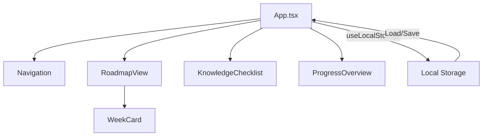

# FullStack Roadmap

A comprehensive interactive learning roadmap application for aspiring fullstack developers. This application helps track progress through a structured 3-month learning path covering frontend, backend, and fullstack development concepts.


## Features

- **Learning Roadmap**: Week-by-week curriculum with detailed resources, checklists, and project requirements
- **Knowledge Checklist**: Track mastery of specific technical skills and knowledge areas
- **Progress Overview**: Visualize overall learning progress with detailed statistics
- **Persistent Storage**: All progress is saved locally in the browser
- **Responsive Design**: Works on desktop and mobile devices

## Tech Stack

- **React 18** with TypeScript
- **Vite** for fast development and optimized builds
- **TailwindCSS** for styling
- **Lucide React** for icons
- **LocalStorage** for data persistence

## Getting Started

### Prerequisites

- Node.js (v16+)
- npm or yarn

### Installation

1. Clone the repository
   ```bash
   git clone https://github.com/yourusername/fullstack-roadmap.git
   cd fullstack-roadmap
   ```

2. Install dependencies
   ```bash
   npm install
   # or
   yarn
   ```

3. Start the development server
   ```bash
   npm run dev
   # or
   yarn dev
   ```

4. Open your browser and navigate to `http://localhost:5173`

## Project Structure

```
src/
├── components/           # React components
│   ├── KnowledgeChecklist.tsx
│   ├── Navigation.tsx
│   ├── ProgressOverview.tsx
│   ├── RoadmapView.tsx
│   └── WeekCard.tsx
├── data/
│   └── roadmapData.ts    # Curriculum and learning content
├── hooks/
│   └── useLocalStorage.ts # Custom hook for local storage
├── types/
│   └── index.ts          # TypeScript type definitions
├── App.tsx               # Main application component
└── main.tsx              # Application entry point
```

## Application Architecture

### Data Flow



### State Management

The application uses React's state management with the `useLocalStorage` custom hook for persistence. The main state is maintained in the `AppState` interface:

```typescript
interface AppState {
  activeWeek: number;
  activeTab: 'roadmap' | 'checklist' | 'progress';
  weekProgress: Record<number, ChecklistItem[]>;
  knowledgeProgress: Record<string, ChecklistItem[]>;
  weekNotes: WeekNote[];
}
```

## Roadmap Content

The application includes a comprehensive curriculum covering:

1. Frontend Development with Next.js
2. React Advanced Patterns
3. Data Fetching with React Query
4. Backend Development with Express.js
5. Database Design and Implementation
6. API Development and Authentication
7. Deployment and DevOps
8. Testing and Quality Assurance

Each week includes:
- Detailed topics
- Learning resources (videos, articles, documentation)
- Project requirements
- Progress tracking checklists

## Customization

### Adding New Weeks

To add new content to the roadmap, edit the `roadmapData.ts` file in the `src/data` directory:

```typescript
export const weeksData: WeekData[] = [
  // Existing weeks...
  {
    id: 13, // New week ID
    title: "Your New Week Title",
    description: "Description of the week's content",
    topics: ["Topic 1", "Topic 2", "Topic 3"],
    resources: [
      {
        type: 'video',
        title: 'Resource Title',
        url: 'https://example.com',
        duration: '2 hours'
      },
      // More resources...
    ],
    checklist: [
      { id: 'w13-task1', task: 'Task description', completed: false },
      // More checklist items...
    ],
    project: {
      title: "Project Title",
      description: "Project description",
      requirements: ["Requirement 1", "Requirement 2"],
      deliverables: ["Deliverable 1", "Deliverable 2"]
    }
  }
];
```

### Adding Knowledge Areas

To add new knowledge areas, edit the `knowledgeAreas` array in the `roadmapData.ts` file:

```typescript
export const knowledgeAreas: KnowledgeArea[] = [
  // Existing areas...
  {
    id: "new-area",
    title: "New Knowledge Area",
    color: "bg-purple-500",
    icon: "icon-name",
    items: [
      { id: 'new-area-1', task: 'Skill description', completed: false },
      // More skills...
    ]
  }
];
```

## Contributing

Contributions are welcome! Please feel free to submit a Pull Request.

1. Fork the repository
2. Create your feature branch (`git checkout -b feature/amazing-feature`)
3. Commit your changes (`git commit -m 'Add some amazing feature'`)
4. Push to the branch (`git push origin feature/amazing-feature`)
5. Open a Pull Request

## License

This project is licensed under the MIT License - see the LICENSE file for details.

## Acknowledgments

- React and Vite teams for the amazing tools
- TailwindCSS for the styling framework
- All the content creators referenced in the learning resources 